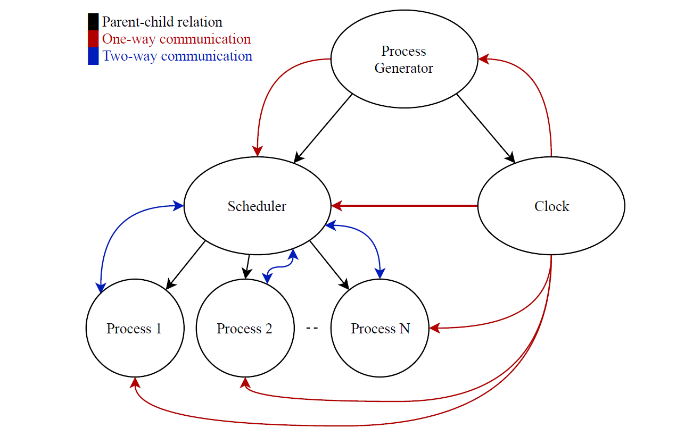
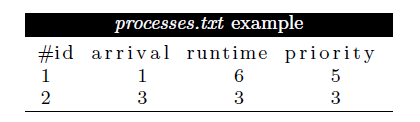
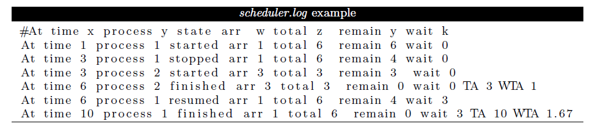
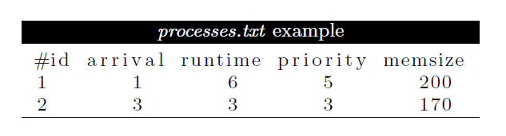
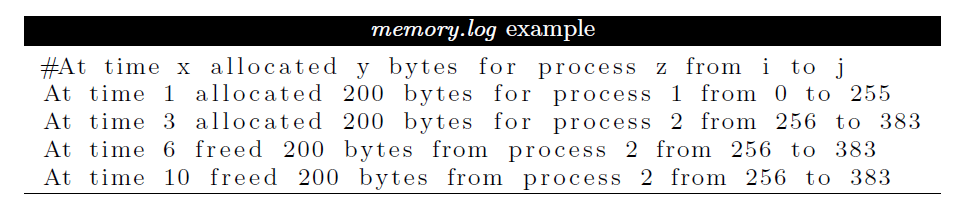

<div align="center">

# OScheduler
<div align="center">

[](https://github.com/Abd-ELrahmanHamza/OScheduler/contributors)
[](LICENSE)
[](https://github.com/Abd-ELrahmanHamza/OScheduler/network)
[](https://github.com/Abd-ELrahmanHamza/OScheduler/stargazers)
[](https://github.com/Abd-ELrahmanHamza/OScheduler/issues)

</div>
</div>

<div align="center">

An Operating systems scheduler

</div>

## Description

### Phase 1

* A CPU scheduler determines an order for the execution of its scheduled processes.
* Computer with 1-CPU and infnite memory. It is required to make a scheduler with its complementary components as sketched in the following diagrams.
<div align = "center">



</div>

#### Process generator
* Read the processes to schedule from input file
* Ask the user for the chosen scheduling algorithm (and its parameters in case of **Round Robin (RR)** which is the **quantum**)
* Initiate and create the scheduler and clock processes.
* Send process information to the scheduler when it arrives

#### Clock

* The clock module is used to emulate an integer time clock.

#### Scheduler
* It keeps track of the processes and their
states and it decides - based on the used algorithm - which process will run and for how long.

* Algorithms used: -
    1. Non-preemptive Highest Priority First (HPF).
    2. Shortest Remaining time Next (SRTN).
    3. Round Robin (RR).

#### Process

* Each process should act as if it is CPU-bound.   

### Input/Output
* Input File

<div align = "center">



</div>

* Output File
    * Record state of processes : started, resumed, stopped, finished.
    * TA (Turnaround time) & WTA(Weighted turnaround time) are written only at finished state.

<div align = "center">



</div>

* Scheduler.pref
Contains
    * CPU utilization
    * Average turnaround time
    * Average weighted turnaround time
    * Standard deviation of weighted turnaround time
<hr>

### Phase 2

* Scheduler is edited to include memory allocation capabilities using the **buddy memory allocation system**. It should allocate memory space for processes as they enter the system and free it as they leave so that it can be re-used by later processes.
* The total memory size is 1024 bytes.

#### Input file edit
<div align = "center">



</div>

#### Memorylog
<div align = "center">



</div>

## Getting Started

### Dependencies

* Platform: Linux
* Language: C

### Installing


```
git clone https://github.com/Abd-ELrahmanHamza/OScheduler
``` 

### Executing program

* Direct to the folder of phase1 ot phase2
* Open terminal
```
make
```
or 
```
make build
```
```
./test_generator.out
```
* Enter number of processes to be generated
```
make run
```
* Select algorithm

## Contributors

<table>
  <tr>

<td align="center">
<a href="https://github.com/Abd-ELrahmanHamza" target="_black">
<br /><sub><b>Abdelrahman Hamza</b></sub></a><br />
</td>

 <td align="center">
<a href="https://github.com/BeshoyMorad" target="_black">
<br /><sub><b>Beshoy Morad</b></sub></a><br />
</td>

<td align="center">
<a href="https://github.com/ZeyadTarekk"  target="_black">
<br /><sub><b>Zeyad Tarek</b></sub></a><br />
</td>

<td align="center">
<a href="https://github.com/ZiadSheriif" target="_black">
<br /><sub><b>Ziad Sherif</b></sub></a><br />
</td>
 

</tr>
 </table>

## License

This project is licensed under the [MIT] License - see the [LICENSE.md](LICENSE) file for details